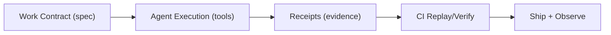

# ToolMesh

An agent-native AI engineering lab.

**Tagline:** Prompts → Proof

## What we’re building

Most engineering workflows and tooling were designed for humans. When the *executor* becomes an AI agent, we need new primitives:

- **Machine-readable work contracts** (inputs/outputs, constraints, acceptance gates)
- **Replayable evidence** (what happened, why it’s safe, how to verify)
- **Tool interoperability** (glue around existing models/runtimes, not “new models”)

ToolMesh is our umbrella for experiments, open-source components, and productized delivery that make agents reliable at enterprise quality.

## Flagship wedge (v0)

**ReceiptCI / Proofpack** — a proof-carrying CI gate for agent work.

Every agent change ships with a **work contract** + **receipts** (evidence) + a **replay path** CI can verify deterministically.

## How we work (lab → product)

We ship small “test rigs” through the same agent-first flow, then productize the reusable parts:

## What we ship

- **Templates & pipelines** for agent-native delivery
- **Reference projects** (our “showroom”)
- **Curated resources**: [awesome-ai-agents](https://github.com/Real-AI-Engineering/awesome-ai-agents)
- Hub repo + pitch notes: [toolmesh](https://github.com/Real-AI-Engineering/toolmesh)

## Work with us

**Agent-to-Prod Sprint (2–4 weeks)**: we help teams install an agent-first SDLC (contracts, receipts, quality gates) and deliver the first production use-case.

## Contribute

Open issues/PRs in any repo, or start with the showroom hub (coming soon).
